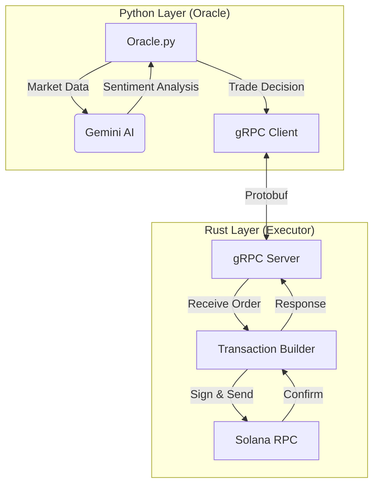

# Sovereign: AI-Driven High-Frequency Trading System

[](https://opensource.org/licenses/MIT)
[](https://www.rust-lang.org/)
[](https://www.python.org/)
[](https://solana.com/)

**[日本語版 README (Japanese Version)](./README_JP.md)**

Sovereign is an advanced, hybrid architecture trading bot designed for the Solana blockchain. It combines the ease of Python for AI-driven decision making with the raw performance of Rust for high-frequency trade execution.

## 🚀 Key Features

*   **Hybrid Architecture**: 
    *   **Oracle (Python)**: Handles market analysis, AI inference (Google Gemini 2.0), and strategy logic.
    *   **Executor (Rust)**: Handles private key management, transaction signing, and high-speed RPC communication via gRPC.
*   **AI Integration**: Utilizes Google's Gemini Flash model to analyze market sentiment and technical indicators in real-time.
*   **Multi-Token Support**: Dynamically routes trades through SOL, USDC, or USDT based on available balances and liquidity.
*   **Resilience & Reliability**:
    *   **RPC Fallback**: Automatic switching between primary and backup RPC endpoints (Project Serum, Extrnode, etc.).
    *   **Smart Retries**: Exponential backoff strategies for network glitches.
*   **Security**: Private keys are isolated within the compiled Rust binary, never exposed to the Python layer or logs.

## 🏗 Architecture



## 🛠 Prerequisites

*   **Rust**: `cargo` and `rustc` (latest stable).
*   **Python**: Version 3.10 or higher.
*   **Solana CLI**: For wallet management (optional but recommended).
*   **Google Gemini API Key**: For AI features.

## 📦 Installation

1.  **Clone the Repository**
    ```bash
    git clone https://github.com/naki0227/sovereign-executor.git
    cd sovereign-executor
    ```

2.  **Install Python Dependencies**
    ```bash
    pip install -r requirements.txt
    ```

3.  **Build the Rust Executor**
    ```bash
    cd executor
    cargo build --release
    cd ..
    ```

4.  **Generate Protocol Buffers**
    If you modify `sovereign.proto`, regenerate the Python gRPC code:
    ```bash
    python3 -m grpc_tools.protoc -I. --python_out=. --grpc_python_out=. sovereign.proto
    ```

## ⚙️ Configuration

Create a `.env` file in the root directory:

```env
# AI Configuration
GEMINI_API_KEY=your_google_gemini_api_key

# Solana Configuration
SOLANA_RPC_URL=https://api.mainnet-beta.solana.com
SOLANA_PRIVATE_KEY=your_base58_private_key

# Notification (Optional)
DISCORD_WEBHOOK_URL=your_discord_webhook_url
```

## 🚀 Usage

### 1. Start the Executor (Rust)
The executor listens for trade commands on a local gRPC port.
```bash
./executor/target/release/executor
```

### 2. Start the Oracle (Python)
In a separate terminal, start the decision engine.
```bash
python3 oracle.py
```

## 📂 Project Structure

*   `executor/`: Rust source code for the high-performance execution engine.
*   `oracle.py`: Main Python script for strategy and AI logic.
*   `sovereign.proto`: Protocol Buffer definition for gRPC communication.
*   `scripts/`: Utility scripts (wallet creation, balance checks, etc.).
*   `tests/`: Unit and integration tests.
*   `archive/`: Legacy logs and deprecated scripts.
*   `ledger.csv`: Local record of all executed trades.

## ⚠️ Disclaimer

This software is for educational and experimental purposes only. Cryptocurrency trading involves significant financial risk. The authors are not responsible for any financial losses incurred while using this bot. Use at your own risk.

## 📜 License

MIT License
