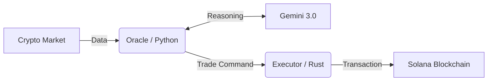

# 🦅 Sovereign: The AI-Native Solana Executor

[](https://opensource.org/licenses/MIT)
[](https://deepmind.google/technologies/gemini/)
[](https://solana.com/)

**[日本語 (Japanese) ->](./README_JP.md)**

## 🤔 What is Sovereign?

**Sovereign is an autonomous trading entity that lives on the Solana blockchain.**

It is not just a script; it is a **cyber-organism** designed to survive and thrive in the brutal, high-speed environment of crypto markets. By fusing the reasoning capabilities of **Google Gemini 3.0** with the raw execution speed of **Rust**, Sovereign aims to bridge the gap between human intuition and machine precision.

Think of it as a "Digital Hedge Fund Manager" that never sleeps, constantly monitoring the chain for opportunities, analyzing sentiment, and executing trades with millisecond latency.

---

## ✨ Why is it Special?

### 🧠 The Brain: Gemini 3.0 Integration
Unlike traditional bots that rely solely on hard-coded indicators (RSI, MACD), Sovereign **"reads" the market**. It uses the advanced context understanding of Gemini 3.0 to interpret complex market conditions, spotting trends and anomalies that simple algorithms miss.

### ⚡ The Body: Rust execution
Reasoning is nothing without action. The "Executor" core is built in **Rust**—the same language powering Solana itself. It handles transaction signing and network communication with extreme efficiency, ensuring that when the AI says "Go," the trade happens *instantly*.

### 🛡️ The Shield: Unstoppable Resilience
Markets are chaotic. APIs fail. RPCs go down. Sovereign includes:
- **Self-Healing Networks**: Automatically switches between Solana RPC endpoints if one fails.
- **Dynamic Routing**: Intelligently swaps between SOL, USDC, and USDT based on what's in your wallet.
- **Private Key Isolation**: Your keys are locked inside the compiled Rust binary, keeping them safe from prying eyes.

---

## 🏗 System Architecture

The system is a symbiosis of two parts:

1.  **The Oracle (Brain 🐍)**: A Python-based intelligence layer that digests market data and consults Gemini 3.0.
2.  **The Executor (Muscle 🦀)**: A Rust-based engine that receives encrypted commands and talks directly to the blockchain.



## 🚀 Getting Started

### Prerequisites
- **Rust** & **Cargo** (for the engine)
- **Python 3.10+** (for the brain)
- **Gemini API Key** (for the intelligence)

### Quick Setup

1.  **Awaken the Code**
    ```bash
    git clone https://github.com/naki0227/sovereign-executor.git
    cd sovereign-executor
    pip install -r requirements.txt
    ```

2.  **Forge the Engine**
    ```bash
    cd executor
    cargo build --release
    ```

3.  **Configure the Soul**
    Create a `.env` file with your credentials:
    ```env
    GEMINI_API_KEY=your_key_here
    SOLANA_PRIVATE_KEY=your_key_here
    ```

4.  **Run**
    - Terminal 1: `./executor/target/release/executor`
    - Terminal 2: `python3 oracle.py`

---

*“The future of trading belongs to those who can think fast and act faster.”*
