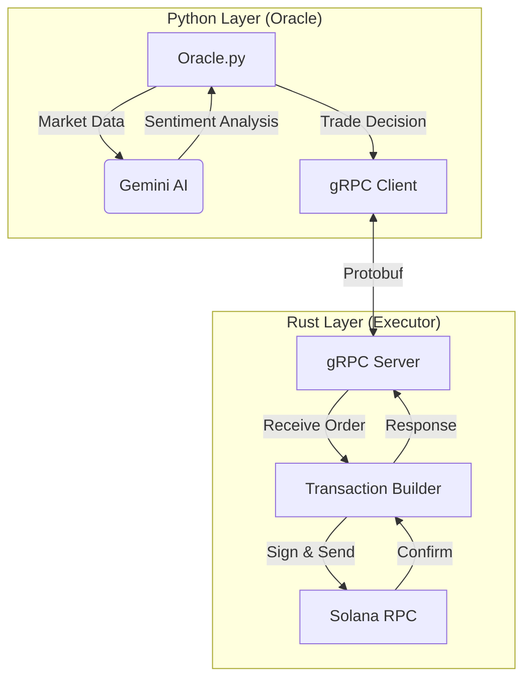

# Sovereign: AI駆動型 高頻度取引システム

[](https://opensource.org/licenses/MIT)
[](https://www.rust-lang.org/)
[](https://www.python.org/)
[](https://solana.com/)

**[English README](./README.md)**

Sovereignは、Solanaブロックチェーン向けに設計された、ハイブリッドアーキテクチャ採用の最先端トレーディングボットです。PythonによるAI駆動の柔軟な意思決定と、Rustによる超高速なトランザクション実行を融合させています。

## 🚀 主な機能

*   **ハイブリッドアーキテクチャ**:
    *   **Oracle (Python)**: 市場分析、AI推論 (Google Gemini 3)、戦略ロジックを担当。
    *   **Executor (Rust)**: 秘密鍵管理、トランザクション署名、gRPC経由の高速RPC通信を担当。
*   **AI統合**: Google Gemini Flashモデルを使用し、市場センチメントとテクニカル指標をリアルタイムで分析・判断。
*   **マルチトークン対応**: SOL, USDC, USDTの残高と流動性に基づき、最適な取引ルートを動的に選択。
*   **耐障害性と信頼性**:
    *   **RPCフォールバック**: プライマリRPCがダウンした場合、自動的にバックアップRPC (Project Serum, Extrnode等) に切り替え。
    *   **スマートリトライ**: ネットワークエラー時、指数バックオフ戦略を用いて再試行。
*   **セキュリティ**: 秘密鍵はコンパイルされたRustバイナリ内で管理され、Python層やログには一切露出させません。

## 🏗 アーキテクチャ



## 🛠 前提条件

*   **Rust**: `cargo` および `rustc` (最新の安定版)。
*   **Python**: バージョン 3.10 以上。
*   **Solana CLI**: ウォレット管理用（推奨）。
*   **Google Gemini API Key**: AI機能の利用に必要。

## 📦 インストール手順

1.  **リポジトリのクローン**
    ```bash
    git clone https://github.com/naki0227/sovereign-executor.git
    cd sovereign-executor
    ```

2.  **Python依存関係のインストール**
    ```bash
    pip install -r requirements.txt
    ```

3.  **Rust Executorのビルド**
    ```bash
    cd executor
    cargo build --release
    cd ..
    ```

4.  **Protocol Buffersの生成**
    `sovereign.proto` を変更した場合のみ、Python用コードを再生成する必要があります:
    ```bash
    python3 -m grpc_tools.protoc -I. --python_out=. --grpc_python_out=. sovereign.proto
    ```

## ⚙️ 設定

ルートディレクトリに `.env` ファイルを作成し、以下の変数を設定してください:

```env
# AI Configuration
GEMINI_API_KEY=your_google_gemini_api_key

# Solana Configuration
SOLANA_RPC_URL=https://api.mainnet-beta.solana.com
SOLANA_PRIVATE_KEY=your_base58_private_key

# Notification (Optional)
DISCORD_WEBHOOK_URL=your_discord_webhook_url
```

## 🚀 使用方法

### 1. Executor (Rust) の起動
ExecutorはローカルgRPCポートで待機し、Pythonからの命令を待ち受けます。
```bash
./executor/target/release/executor
```

### 2. Oracle (Python) の起動
別のターミナルで、意思決定エンジンを起動します。
```bash
python3 oracle.py
```

## 📂 プロジェクト構成

*   `executor/`: 高性能実行エンジンのRustソースコード。
*   `oracle.py`: 戦略とAIロジックを記述したメインPythonスクリプト。
*   `sovereign.proto`: gRPC通信用のプロトコル定義。
*   `scripts/`: ユーティリティスクリプト (ウォレット作成、残高確認など)。
*   `tests/`: ユニットテストおよび統合テスト。
*   `archive/`: 過去のログや廃止されたスクリプト。
*   `ledger.csv`: 全取引記録をローカルに保存する台帳。

## ⚠️ 免責事項

本ソフトウェアは教育および実験目的で提供されています。暗号資産取引には重大な金銭的リスクが伴います。本ボットの使用によって発生したいかなる損失についても、作者は責任を負いません。自己責任でご利用ください。

## 📜 ライセンス

MIT License
