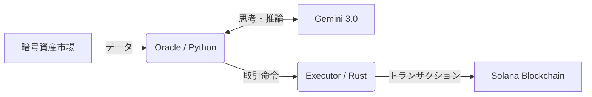

# 🦅 Sovereign: AIネイティブ・ソラナ・エグゼキューター

[](https://opensource.org/licenses/MIT)
[](https://deepmind.google/technologies/gemini/)
[](https://solana.com/)

**[English Ver. ->](./README.md)**

## 🤔 Sovereignとは？

**Sovereign（ソブリン）は、Solanaブロックチェーン上に生息する自律型トレーディング生命体です。**

これは単なる自動売買スクリプトではありません。**Google Gemini 3.0** の高度な「推論能力」と、**Rust** 言語による「超高速実行」を融合させることで、過酷な暗号資産市場を生き抜くために設計されました。

例えるなら、**「24時間365日、決して眠らない熟練のヘッジファンドマネージャー」**。
市場のわずかな変化をAIが感じ取り、Rustの強靭な肉体が瞬きする間もなく取引を執行します。

---

## ✨ 何が特別なのか？

### 🧠 「脳」としてのAI (Gemini 3.0)
従来のボットは「RSIが70を超えたら売る」といった単純なルールに縛られていました。
Sovereignは違います。Gemini 3.0 を搭載することで、**市場の文脈（コンテキスト）を読む**ことができます。突発的なニュース、価格変動の質、全体の空気を総合的に判断し、人間のような柔軟さで戦略を組み立てます。

### ⚡ 「筋肉」としてのRust
どれほど優れた頭脳があっても、動きが遅ければ市場では勝てません。
Sovereignの実行エンジン（Executor）は、Solana自体と同じ **Rust** 言語で構築されています。AIが「GO」と判断した瞬間、ミリ秒単位の速さでブロックチェーンにトランザクションを叩き込みます。これはPythonだけのボットには真似できない領域です。

### 🛡️ 鉄壁の守り
APIサーバーが落ちても、Sovereignは止まりません。
- **自己修復ネットワーク**: 接続先（RPC）がダウンした場合、即座に別の経路を見つけて接続を維持します。
- **マルチトークン戦略**: 手持ちがUSDCでもUSDTでもSOLでも、その場にある資金を自動で認識して戦います。
- **セキュリティ**: 命綱である「秘密鍵」は、コンパイルされたRustバイナリの奥深くに隔離されており、外部からは見えません。

---

## 🏗 システム構成図

このシステムは、2つの異なる種族の共生によって成り立っています。

1.  **Oracle (Python) 🐍**: データを咀嚼し、Gemini 3.0と対話して戦略を練る「頭脳」。
2.  **Executor (Rust) 🦀**: 暗号化された指令を受け取り、ブロックチェーンと直接対話する「肉体」。



## 🚀 始め方 (Quick Start)

### 必要なもの
- **Rust** & **Cargo** (エンジンを動かすため)
- **Python 3.10+** (頭脳を動かすため)
- **Gemini API Key** (魂を吹き込むため)

### セットアップ

1.  **コードの召喚**
    ```bash
    git clone https://github.com/naki0227/sovereign-executor.git
    cd sovereign-executor
    pip install -r requirements.txt
    ```

2.  **エンジンの鍛造**
    ```bash
    cd executor
    cargo build --release
    ```

3.  **魂の設定**
    `.env` ファイルを作成し、鍵を設定します:
    ```env
    GEMINI_API_KEY=あなたのGeminiキー
    SOLANA_PRIVATE_KEY=あなたの秘密鍵
    ```

4.  **起動**
    - ターミナル1: `./executor/target/release/executor`
    - ターミナル2: `python3 oracle.py`

---

*“未来をつかむのは、誰よりも速く考え、誰よりも速く動く者だけだ。”*
